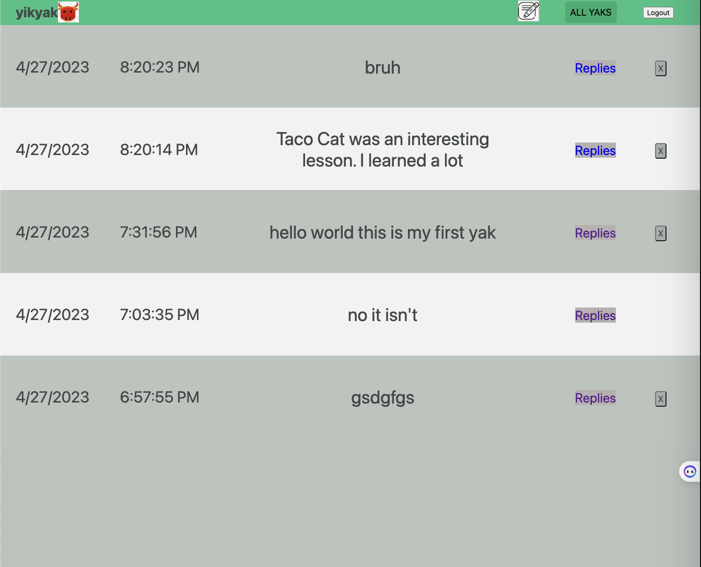

  

<h3 align="center">Yikyak</h3>

---

 Welcome to Yikyak. This social media platform allows users to share what's on their minds while staying completely annonymous.

## 🧐 About

I decided to build this application because many social media users do not post what's on their minds. The fear of public perception often dissuades them from posting what they think. Yikyak, the most popular social media platform for annonymous posting, was removed in the United States. In response, I built this application to give back to the users their ability to stay anonymous while posting.

## 🏁 Getting Started

Visit <a href="https://annonymous.fly.dev/">Yikyak</a> to use the app.
 
Visit <a href="https://trello.com/b/JXLooI1t/yik-yak">Trello</a> to view the planning materials.

### Prerequisites

Access to the internet is required. 
The latest version of Google Chrome is recommended for the best user experience, but not required.

## 🎈 Attributions

- [The-Documentation-Compendium by Kyle Lobo](https://github.com/kylelobo/The-Documentation-Compendium) - README Format
- [Pngtree](https://pngtree.com/so/ox-logo) - Favicon
- [Flaticon](https://www.flaticon.com) - Images
- [Font Awesome](https://fontawesome.com/) - Font and Style

## ⛏️ Technologies Used

- [Fly](https://fly.io/) - Deployment
- [Github](https://github.com/) - Version Control, Code Hosting
- [Git](https://git-scm.com/) - Version Control and Source Code Management
- [Visual Studio Code](https://code.visualstudio.com/) - Debugging, Version Control
- [EJS](https://ejs.co/) - Embedding
- [Trello](https://trello.com/) - Project Planning
- [Mongoose](https://mongoosejs.com/) - Application Modeling
- [Whimsical](https://whimsical.com/) - ERD
- [Google OAuth](https://developers.google.com/) - Authentication
- [MongoDB](Databasemongodb.com/) - Database
- [Figma](figma.com/) - Wireframes
- [Express.js](https://expressjs.com/) - Web Framework
- [Node.js](https://nodejs.org/en/) - Runtime Environment
- JavaScript - User Interaction
- CSS - Style

## 🚀 Icebox

- Iterate on the current styling.
- AAU, I want to press a "like" or "dislike" button, so that I can see the net likes for each yak on the "All Yaks" page.
- AAU that owns a yak, I want to press a button to pin a comment, so that it displays at the top of the comments table. 
- AAU, I want to see my 'Yakarma' score calculated from the net total likes and dislikes associated with my profile, so that I can see my net total likes and dislikes.
 
## ✍️ Authors

- [@korycfitz](https://github.com/korycfitz) - Work
- [yikyak](https://yikyak.com/) - Idea